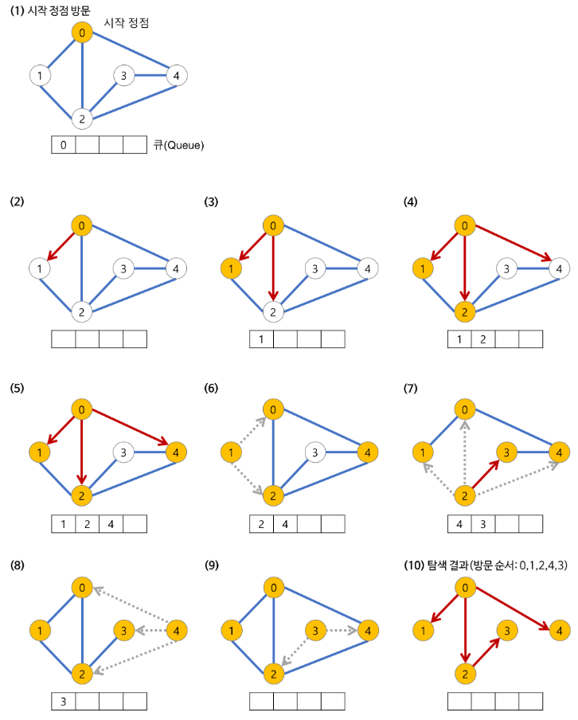

# 너비 우선 탐색(BFS)

---


## 너비 우선 탐색(BFS)이란?

**B**readth **F**irst **S**earch. 

트리나 그래프를 방문 또는 탐색하는 방법 중 하나로 인접한 노드를 먼저 탐색하는 방법.

시작 정점으로부터 가까운 정점을 먼저 방문하고 멀리 떨어져 있는 정점을 나중에 방문하는 순회함으로써 **노드를 넓게(Wide) 탐색**

주로 두 노드 사이의 최단 경로 혹은 임의의 경로를 찾고 싶을 때 이 방법을 사용.

(PS에서는 주로 퍼즐이나 최적 경로 탐색 문제 등에서 주로 쓰임)




1. **a 노드(시작 노드)를 방문한다. (방문한 노드 체크)**

- 큐에 방문된 노드를 삽입(enqueue)한다.
- 초기 상태의 큐에는 시작 노드만이 저장
    - 즉, a 노드의 이웃 노드를 모두 방문한 다음에 이웃의 이웃들을 방문한다.

2. **큐에서 꺼낸 노드과 인접한 노드들을 모두 차례로 방문한다.**
    - 큐에서 꺼낸 노드를 방문한다.
    - 큐에서 커낸 노드과 인접한 노드들을 모두 방문한다.
        - 인접한 노드가 없다면 큐의 앞에서 노드를 꺼낸다(dequeue).
    - 큐에 방문된 노드를 삽입(enqueue)한다.

3. **큐가 소진될 때까지 계속한다.**

즉, 현재 노드에서 인접 노드들을 큐에 담고 하나씩 방문(pop)하며 인접 노드들을 다시 큐에 담는 과정을 반복하는 것이다.

```c
void search(Node root) {
  Queue queue = new Queue();
  root.marked = true; // (방문한 노드 체크)
  queue.enqueue(root); // 1-1. 큐의 끝에 추가

  // 3. 큐가 소진될 때까지 계속한다.
  while (!queue.isEmpty()) {
    Node r = queue.dequeue(); // 큐의 앞에서 노드 추출
    visit(r); // 2-1. 큐에서 추출한 노드 방문
    // 2-2. 큐에서 꺼낸 노드와 인접한 노드들을 모두 차례로 방문한다.
    foreach (Node n in r.adjacent) {
      if (n.marked == false) {
        n.marked = true; // (방문한 노드 체크)
        queue.enqueue(n); // 2-3. 큐의 끝에 추가
      }
    }
  }
}
```

### 너비 우선 탐색(BFS)  장점

- 노드 수가 적거나 깊이가 얕은 경우 빠른 탐색 가능
- 경로가 여러개인 경우에도 최단 경로 보장
- 깊이 우선 탐색(DFS)으로는 한 경로가 무한히 깊어지면 경로를 찾기 힘들지만, 너비 우선 탐색(BFS)에서는 반드시 최단 경로를 찾을 수 있음

즉, 최적해를 찾을 수 있음을 보장

### 너비 우선 탐색(BFS) 단점

- 재귀호출의 DFS와는 달리 큐에 다음에 탐색할 정점들을 저장해야 하므로 저장공간이 많이 필요
- 해가 존재하지 않는다면 유한 그래프(finite graph)의 경우에는 모든 그래프를 탐색한 후에 실패로 끝이 남
- 노드의 수가 늘어나면 탐색해야하는 노드가 많아지기 때문에 비효율적

## **참조**
[[알고리즘] 너비 우선 탐색(BFS)이란 - Heee's Development Blog](https://gmlwjd9405.github.io/2018/08/15/algorithm-bfs.html)

[[Algorithm] BFS 알고리즘 (Breadth-First Search)](https://coding-factory.tistory.com/612)

[BFS](https://namu.wiki/w/%EB%84%88%EB%B9%84%20%EC%9A%B0%EC%84%A0%20%ED%83%90%EC%83%89)