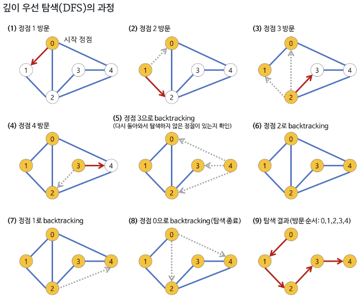

# 깊이 우선 탐색(DFS)

## 깊이 우선 탐색(DFS)이란?

---

**D**epth-**F**irst **S**earch.

트리나 그래프를 방문 또는 탐색하는 방법 중 하나로 시작 노드에서 다음 분기로 넘어가기 전까지 해당 분기를 완벽하게 탐색하는 방법

트리와 그래프에서 최대한 깊게 탐색을 하고 돌아가 다시 다른 루트를 탐색하는 깊은(Deep) 탐색

주로 연결된 그래프를 완전 탐색하는 완전 탐색 문제를 해결할떄 활용함.

## 참조

[[알고리즘] 깊이 우선 탐색(DFS)이란 - Heee's Development Blog](https://gmlwjd9405.github.io/2018/08/14/algorithm-dfs.html)